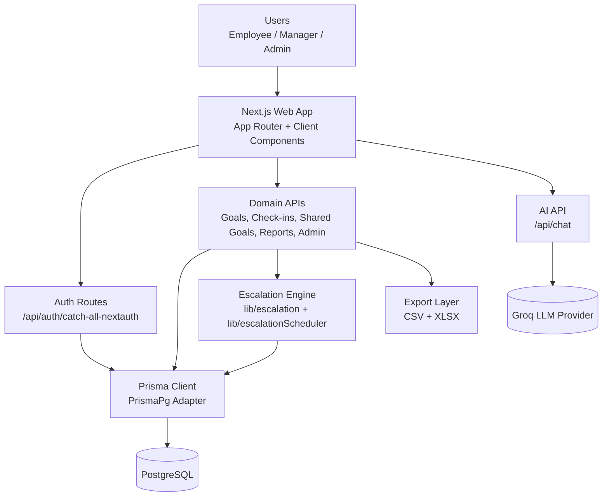
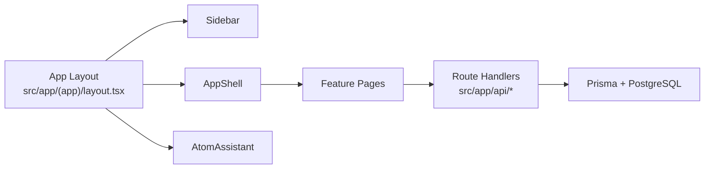
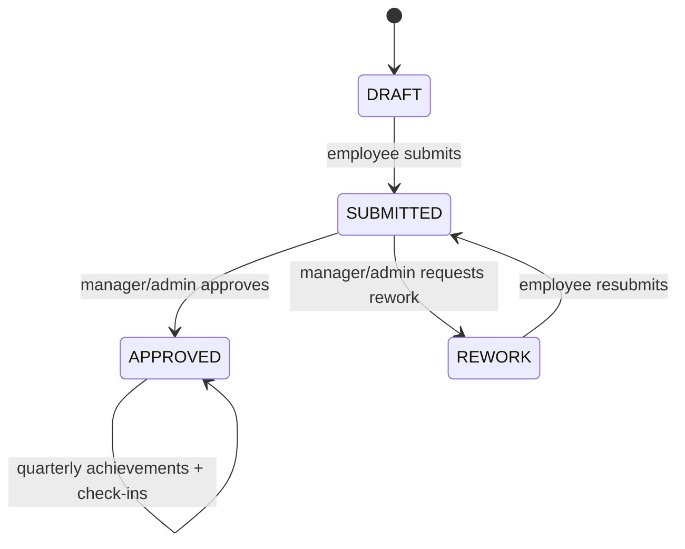
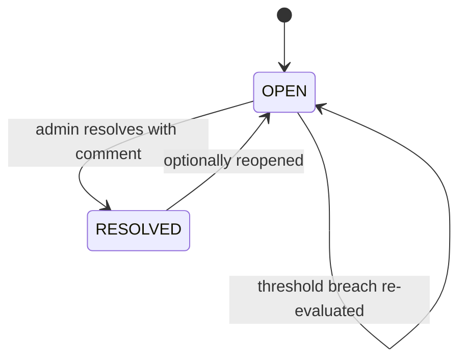
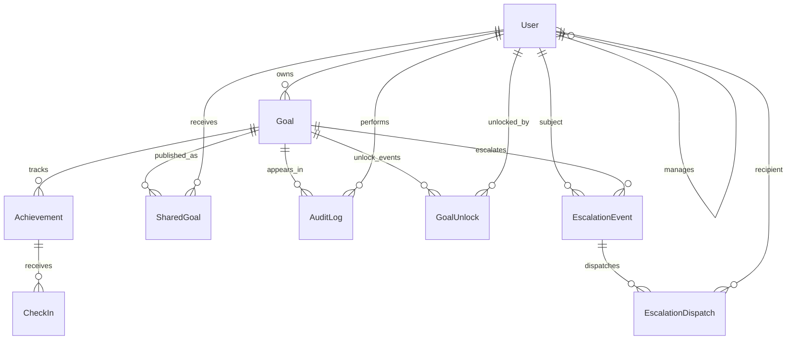

# Atom Goal Management Portal

Atom is a role-based performance management system for defining goals, approving submissions, tracking quarterly achievements, handling escalations, and generating analytics.

The application is built on Next.js App Router with Prisma and PostgreSQL, and includes AI-assisted goal drafting and quality review workflows.

## Table of Contents
- [Core Capabilities](#core-capabilities)
- [Role Model](#role-model)
- [Architecture](#architecture)
- [Goal and Escalation Lifecycles](#goal-and-escalation-lifecycles)
- [Data Model](#data-model)
- [API Surface](#api-surface)
- [Project Structure](#project-structure)
- [Configuration](#configuration)
- [Runbook](#runbook)
- [Documentation Folder](#documentation-folder)

## Core Capabilities
- Goal creation with UoM models (`MIN`, `MAX`, `TIMELINE`, `ZERO`)
- Weightage governance (minimum goal weightage and 100% total allocation checks)
- Manager approval and rework loop (`DRAFT -> SUBMITTED -> APPROVED/REWORK`)
- Quarterly achievement logging and manager check-in comments
- Shared goal distribution to multiple recipients with recipient-level weightage
- Rule-based escalation engine with resolution workflow
- Admin cycle controls (active FY, goal window, check-in window)
- Analytics dashboard with filters and CSV/XLSX export
- In-app AI assistant and goal quality tools

## Role Model
| Role | Typical Responsibilities |
|---|---|
| `EMPLOYEE` | Create and submit goals, log quarterly achievements, monitor notifications |
| `MANAGER` | Approve/rework goals, review check-ins, push shared goals, monitor team metrics |
| `ADMIN` | Manage cycles, unlock goals, configure escalation rules, resolve escalations, system oversight |

## Architecture

### System Architecture


### Runtime Layout


## Goal and Escalation Lifecycles

### Goal Lifecycle


### Escalation Lifecycle


## Data Model

### Domain ER Diagram


Primary models are defined in `prisma/schema.prisma`.

## API Surface

### Authentication
- `GET/POST /api/auth/[...nextauth]`

### Goals and Progress
- `GET /api/goals`
- `POST /api/goals`
- `GET /api/goals/[id]`
- `PATCH /api/goals/[id]`
- `POST /api/achievements`
- `POST /api/checkins`

### Shared Goals
- `GET /api/shared-goals`
- `POST /api/shared-goals`
- `PATCH /api/shared-goals/[id]`

### Cycles and Reporting
- `GET /api/cycle`
- `GET /api/reports`
- `GET /api/notifications`

### AI
- `POST /api/chat`

### Admin Operations
- `GET /api/admin/cycles`
- `POST /api/admin/cycles`
- `PATCH /api/admin/cycles/[id]`
- `GET /api/admin/unlocks`
- `POST /api/admin/unlocks`
- `GET /api/admin/escalation-rules`
- `PATCH /api/admin/escalation-rules`
- `GET /api/admin/escalations`
- `POST /api/admin/escalations`
- `PATCH /api/admin/escalations/[id]`

## Project Structure
```text
src/
  app/
    (app)/                     # Authenticated UI routes
      dashboard/
      goals/
      checkin/
      reports/
      notifications/
      admin/
    api/                       # Route handlers
      auth/
      goals/
      achievements/
      checkins/
      shared-goals/
      reports/
      notifications/
      admin/
  components/                  # Reusable UI + shell components
  lib/                         # Auth, Prisma, cycle, escalation, utilities
prisma/
  schema.prisma               # Data model
  seed.ts                     # Seed data
doc/
  FEATURES_AND_USAGE_GUIDE.md # Detailed functional handbook
```

## Configuration
Create `.env` with required variables:

```env
NEXTAUTH_SECRET=...
NEXTAUTH_URL=http://localhost:3000
DATABASE_URL=postgresql://...
DIRECT_URL=postgresql://...
GROQ_API_KEY=...
SMTP_USER=...
APP_PASSWORD=...
```

Notes:
- `DATABASE_URL` is used by runtime queries.
- `DIRECT_URL` is used by Prisma config/migrations.
- If credentials include reserved URL characters, URL-encode them.

## Runbook

### Install
```bash
npm install
```

### Generate Prisma Client (automatic on postinstall)
```bash
npx prisma generate
```

### Seed Initial Data
```bash
npm run seed
```

### Start Development Server
```bash
npm run dev
```

### Build Production Bundle
```bash
npm run build
npm run start
```

### Static Type Validation
```bash
npx tsc --noEmit
```

## Documentation Folder
Detailed functional documentation is available in:

- `doc/FEATURES_AND_USAGE_GUIDE.md`

This document expands on each screen, role behavior, workflows, and operational usage patterns.
